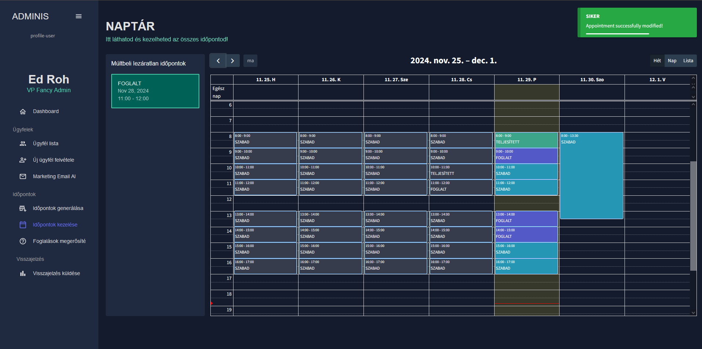
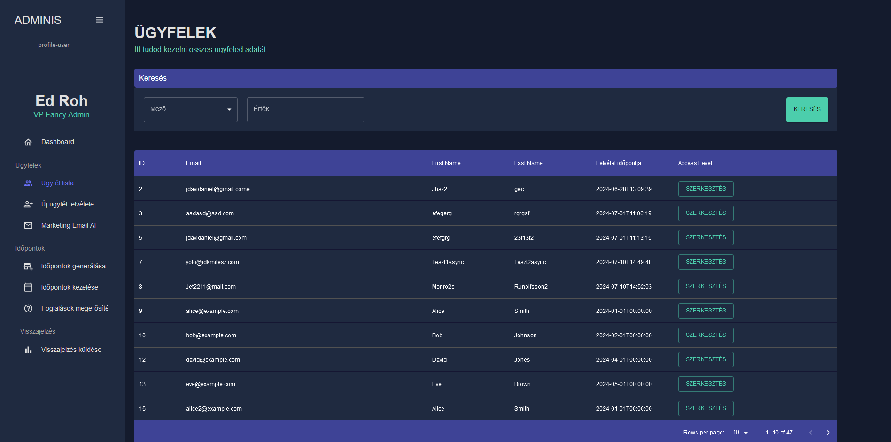

# SpringBoot_appointment-booking 
A REST API made with Spring Boot to allow business owners to easily manage customer's appointments.

## Includes 
-Custom auth using Spring Security and JWT access/refresh tokens
-Logging with logback
-A scheduler service to send reminder emails for customers
-Centralized DB Service in order to make it easier to handle DB errors (was originally planned to make it easier to retry failed db calls, altough that is not included yet)
-Statistics, customer management, appointment management, easy email sending to customers
-Custom APIResponseObject class that allows easy managing of REST responses

## REST API Endpoints Documentation

| HTTP Method | Endpoint                                      | Description                                                                                     | Request Body                                         | Query/Path Params                                   | Response                                                                                  |
|-------------|----------------------------------------------|-------------------------------------------------------------------------------------------------|----------------------------------------------------|---------------------------------------------------|-------------------------------------------------------------------------------------------|
| POST        | `/register`                                  | Registers a new user. Sends a confirmation message upon successful registration.                | `RegistrationRequest`                               | None                                              | `201 CREATED` with `RegistrationResponse` containing the user's email.                    |
| POST        | `/login`                                     | Authenticates a user and returns a token for future requests.                                   | `LoginRequest`                                     | None                                              | `200 OK` with `LoginResponse` containing the token.                                       |
| POST        | `/appointments/generate`                    | Generates multiple appointments based on the request data.                                      | `GenerateAppointmentRequest`                       | None                                              | `200 OK` with APIResponseObject containing appointment details.                           |
| POST        | `/appointments`                             | Creates a single appointment with the provided details.                                         | `CreateSingleAppointment`                          | None                                              | `200 OK` with APIResponseObject containing the created appointment.                       |
| PUT         | `/appointments/{id}`                        | Updates an existing appointment identified by its ID.                                           | `ModifyAppointmentRequest`                         | `id` (Path)                                       | `200 OK` with APIResponseObject containing updated appointment data.                      |
| GET         | `/appointments`                             | Fetches appointments for a specified week.                                                     | None                                               | `startOfWeek` (Query)                             | `200 OK` with a list of appointments for the specified week.                              |
| POST        | `/booking/{id}`                             | Books an appointment identified by its ID.                                                     | `BookAppointmentRequest`                           | `id` (Path)                                       | `200 OK` with a message confirming success.                                               |
| GET         | `/booking`                                  | Fetches available appointments for a specific date.                                             | None                                               | `date` (Query, ISO-8601 format)                   | `200 OK` with a list of available appointments for the specified date.                    |
| POST        | `/booking/confirmation/book/{token}`        | Confirms a booking based on a provided confirmation token.                                      | None                                               | `token` (Path)                                    | `200 OK` with a success message.                                                          |
| POST        | `/booking/confirmation/cancel/{token}`      | Cancels a booking based on a provided cancellation token.                                       | None                                               | `token` (Path)                                    | `200 OK` with a success message.                                                          |
| POST        | `/customers`                                | Creates a new customer with the provided details.                                               | `CreateCustomerRequest`                            | None                                              | `200 OK` with `CreateCustomerResponse` containing the customer's email and join date.     |
| GET         | `/customers`                                | Fetches a paginated list of customers, with sorting options.                                    | None                                               | `pageNo`, `pageSize`, `sortField`, `sortDir`      | `200 OK` with `FetchCustomersResponse` containing customer data.                          |
| GET         | `/customers/search`                         | Searches for customers by a specific field and value.                                           | None                                               | `field`, `value` (Query)                          | `200 OK` with `SearchResponse` containing matching customer data.                         |
| PUT         | `/customers/{id}`                           | Updates the details of a specific customer identified by ID.                                    | `UpdateCustomerRequest`                            | `id` (Path)                                       | `200 OK` with the updated customer data.                                                  |
| GET         | `/statistics`                               | Fetches stats for a given year.                                                                 | None                                               | `yearValue`                                       | `200 OK` with the stats data.                                                  |
| POST        | `/feedback`                                 | Creates feedback from the currently logged-in user.                                             | `CreateFeedbackRequest`                            | None                                              | `200 OK` with an APIResponseObject indicating the feedback creation status.               |

## Frontend 
The frontend was made in React but not included here as it's mostly just made with the help of different LLM's, just for prototyping.
I have included some pictures below

